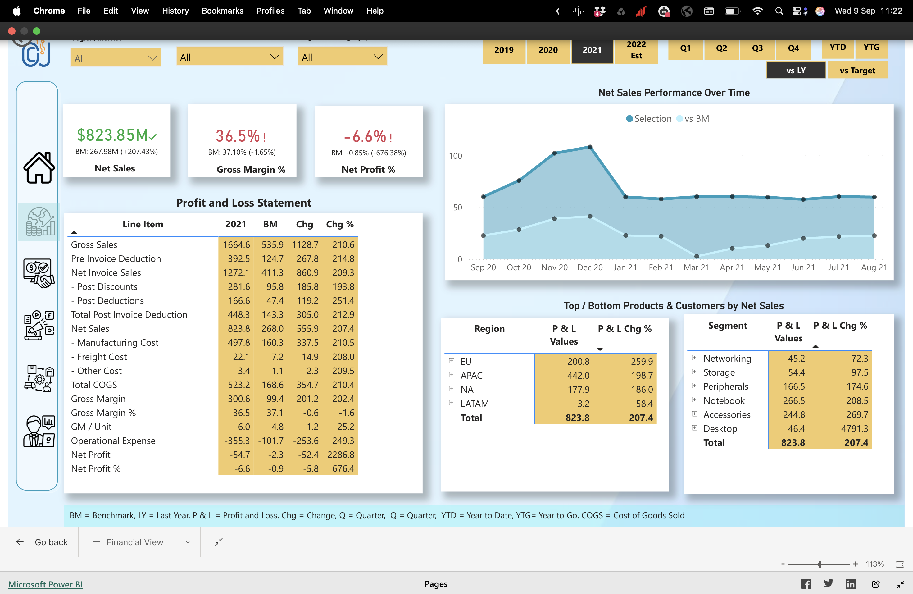
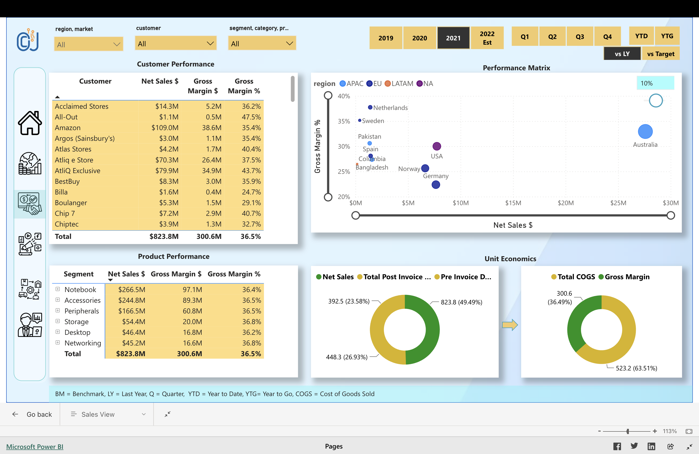
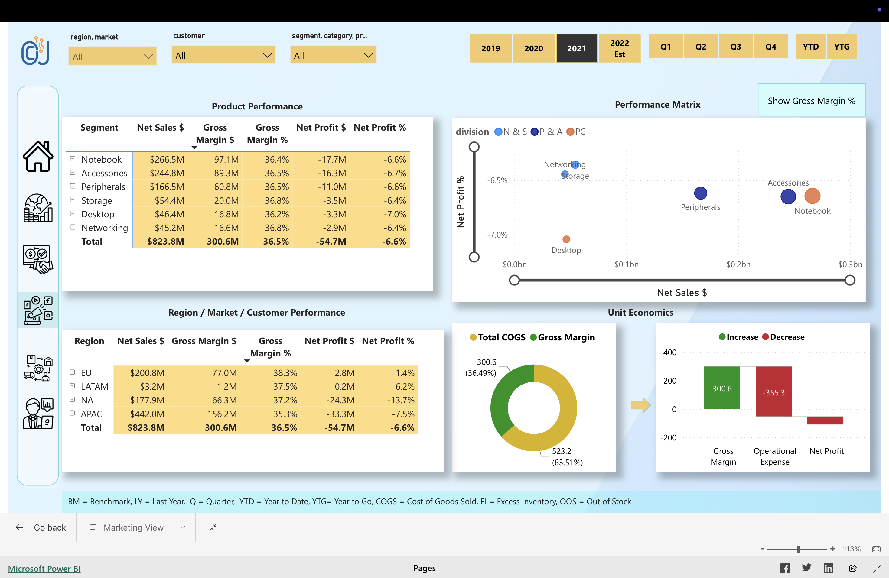
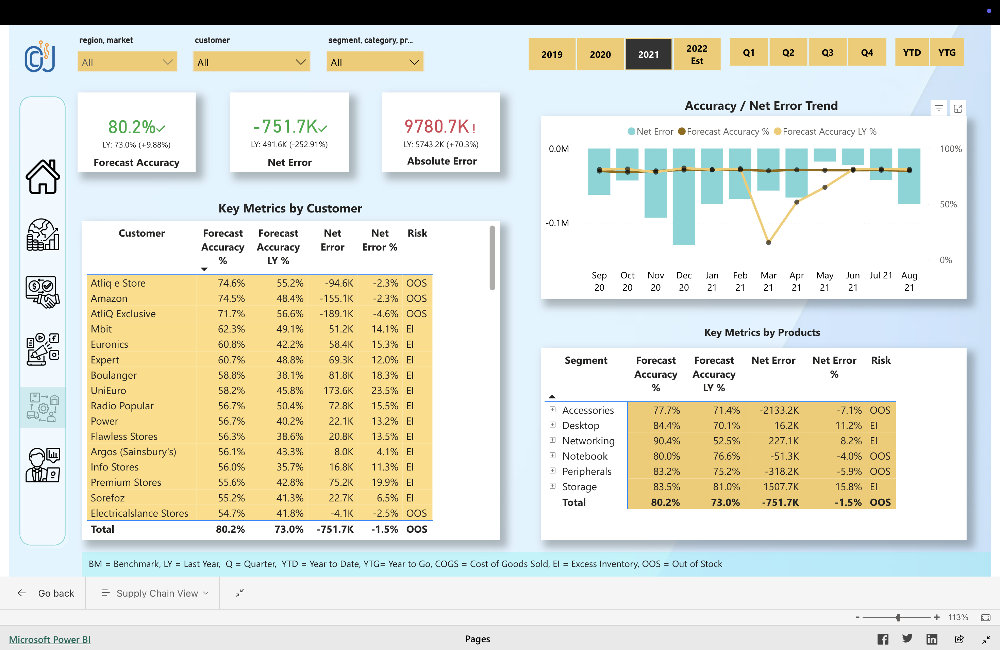
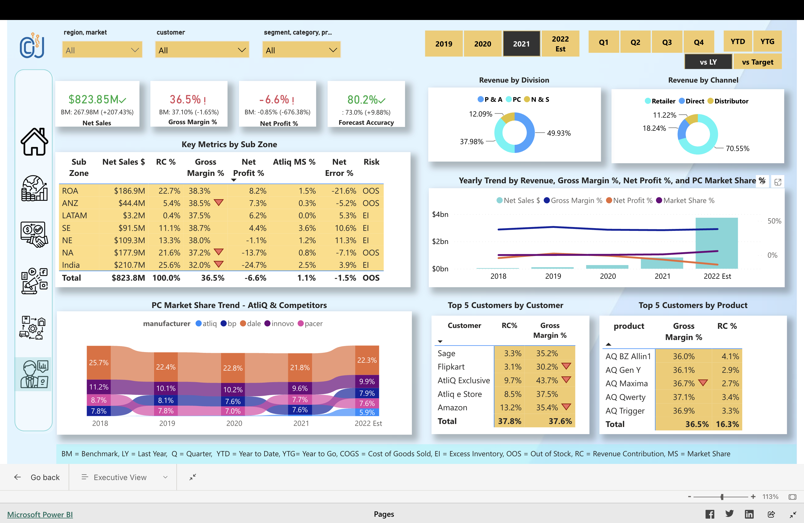

# Business-Insight-360

## Overview

Business Insight 360 is a Power BI project built for **AtliQ Hardware** to bring finance, sales, marketing, supply chain and executive reporting into one interactive solution.

The project uses more than **1.8 million records** from **MySQL and Excel** and focuses on helping different teams understand performance from multiple business angles.

I used **Power Query** for data preparation and transformation, built the reporting model in Power BI, created measures with **DAX**, and used **DAX Studio** to improve performance.

The final report includes separate views for:

- Finance
- Sales
- Marketing
- Supply Chain
- Executive Management

## Data Source and Scope

The project combines business data from:

- **MySQL**
- **Excel**

The data covers areas such as:

- Sales
- Customers
- Products
- Markets
- Regions
- Gross margin
- Net profit
- Forecast accuracy
- Inventory risk
- Revenue contribution
- Market share
- Profit and loss
- Supply chain performance

The report allows users to filter performance by:

- Region
- Market
- Customer
- Segment
- Category
- Product
- Year
- Quarter
- YTD
- YTG
- Last Year
- Target

## Data Preparation and Modelling

The data preparation process involved:

- Connecting Power BI to MySQL and Excel sources.
- Cleaning and transforming raw data using **Power Query**.
- Standardising fields across datasets.
- Creating relationships between fact and dimension tables.
- Building a structured data model for analysis.
- Creating calculated measures using **DAX**.
- Using **DAX Studio** to review and improve model performance.
- Preparing interactive filters and navigation across the report pages.

The goal was to create one reporting solution that could support different departments without requiring separate dashboards for each business function.

## Finance View

The Finance View focuses on overall financial performance and Profit & Loss reporting.

The dashboard includes:

- Net Sales
- Gross Margin %
- Net Profit %
- Profit and Loss Statement
- Net Sales Performance Over Time
- Regional P&L Performance
- Segment Performance

Key figures shown in the report include:

- **Net Sales: $823.85M**
- **Gross Margin: 36.5%**
- **Net Profit: -6.6%**

The Profit and Loss statement also shows:

- Gross Sales
- Pre-Invoice Deductions
- Post-Invoice Deductions
- Net Sales
- Manufacturing Cost
- Freight Cost
- Other Cost
- Total COGS
- Gross Margin
- Operational Expense
- Net Profit

This page makes it easier to compare current performance against benchmark, last year and target values.

## Sales View

The Sales View looks at performance by customers, products and markets.

The report includes:

- Customer Performance
- Product Performance
- Regional Performance
- Gross Margin analysis
- Net Sales analysis
- Unit Economics
- Performance Matrix

The dashboard shows total:

- **Net Sales: $823.8M**
- **Gross Margin: $300.6M**
- **Gross Margin %: 36.5%**

The customer table allows users to compare individual customers by:

- Net Sales
- Gross Margin
- Gross Margin %

The product table also compares segments such as:

- Notebook
- Accessories
- Peripherals
- Storage
- Desktop
- Networking

The Performance Matrix helps show the relationship between **Net Sales** and **Gross Margin %** across markets.

## Marketing View

The Marketing View focuses on product, market and customer profitability.

It includes:

- Product Performance
- Region / Market / Customer Performance
- Performance Matrix
- Unit Economics
- Net Profit analysis

The dashboard shows that:

- Total Net Sales were approximately **$823.8M**.
- Total Gross Margin was approximately **$300.6M**.
- Total Net Profit was approximately **-$54.7M**.
- Overall Net Profit % was approximately **-6.6%**.

The report makes it easier to see which products and markets are generating strong sales but weaker profitability.

For example, some product segments showed strong revenue while still recording negative net profit margins.

This helps distinguish between products that sell well and products that actually contribute to profit.

## Supply Chain View

The Supply Chain View focuses on forecast accuracy, inventory risk and error trends.

The dashboard includes:

- Forecast Accuracy
- Net Error
- Absolute Error
- Customer Risk
- Product Risk
- Forecast Accuracy Trend
- Net Error Trend

The key figures shown include:

- **Forecast Accuracy: 80.2%**
- **Net Error: -751.7K**
- **Absolute Error: 9780.7K**

The report also classifies inventory risk using:

- **OOS – Out of Stock**
- **EI – Excess Inventory**

The customer and product tables make it possible to identify which areas are most affected by forecasting errors.

For example, the report highlights products and customers with:

- Low forecast accuracy
- High positive error
- High negative error
- Out-of-stock risk
- Excess inventory risk

This helps show where supply chain planning may need closer attention.

## Executive View

The Executive View brings together the most important KPIs from across the business.

The dashboard includes:

- Net Sales
- Gross Margin %
- Net Profit %
- Forecast Accuracy
- Revenue by Division
- Revenue by Channel
- Yearly Performance Trends
- Market Share
- Customer Performance
- Product Performance
- Sub-Zone Performance

The main KPIs shown are:

- **Net Sales: $823.85M**
- **Gross Margin: 36.5%**
- **Net Profit: -6.6%**
- **Forecast Accuracy: 80.2%**

Revenue is also broken down by channel, including:

- Retailer
- Direct
- Distributor

The report shows that the Retailer channel contributed the largest share of revenue.

The Executive View also compares market share against competitors and shows how revenue, gross margin, net profit and market share changed over time.

## Key Findings

The analysis showed that:

- Net sales were strong at more than **$823M**.
- Gross Margin remained positive at around **36.5%**.
- Net Profit was negative at around **-6.6%**, showing that strong sales did not translate into overall profitability.
- Forecast Accuracy was around **80.2%**.
- Some customers and product segments showed Out-of-Stock risk.
- Other areas showed Excess Inventory risk.
- Revenue performance varied significantly across markets, regions and products.
- Some high-revenue products still recorded negative net profit margins.
- Retailer was the strongest revenue channel.
- Performance differed across divisions, regions and customer groups.

## Why This Analysis Matters

Looking at sales alone does not give a complete picture of business performance.

This report brings together financial, sales, marketing and supply chain information so that users can see how one area affects another.

For example:

- Strong sales may still result in weak profitability.
- Poor forecast accuracy may lead to excess inventory or stock-outs.
- A high-performing customer may not always have the strongest margin.
- A product with strong revenue may still have a negative net profit.
- Market share can change even when sales are growing.

Bringing these views together makes it easier to identify where the business is performing well and where further attention may be required.

## Tools Used

- **Power BI**
- **Power Query**
- **DAX**
- **DAX Studio**
- **MySQL**
- **Excel**
- **Data Modelling**
- **Data Cleaning**
- **Data Transformation**
- **Data Visualisation**
- **Business Intelligence**
- **Exploratory Data Analysis**

## Dashboard Preview

### Finance View

### Sales View

### Marketing View

### Supply Chain View

### Executive View

## Live Dashboard

[**View the interactive Business Insight 360 Power BI dashboard**](https://app.powerbi.com/view?r=eyJrIjoiZGRhNjYwYTUtZWE3Zi00MzkyLWJhMmItZDE0NzY3NjFkYjJiIiwidCI6ImYyMDIxN2JmLWEwYzYtNDZlNi1hMTdmLTY3YzkwNTY0NDgwZiJ9)

## Key Takeaway

Business Insight 360 shows how different parts of a business can be analysed together rather than in isolation.

The project combines finance, sales, marketing and supply chain data in one report, making it easier to understand how revenue, margin, profitability, forecasting and inventory risk are connected.

The main takeaway from the analysis is that strong sales do not automatically mean strong overall performance. Looking at profitability, forecast accuracy, market share and inventory risk alongside sales gives a much clearer view of the business.

---

## License

This project is licensed under the **MIT License**.

[LICENSE](LICENSE.txt)
